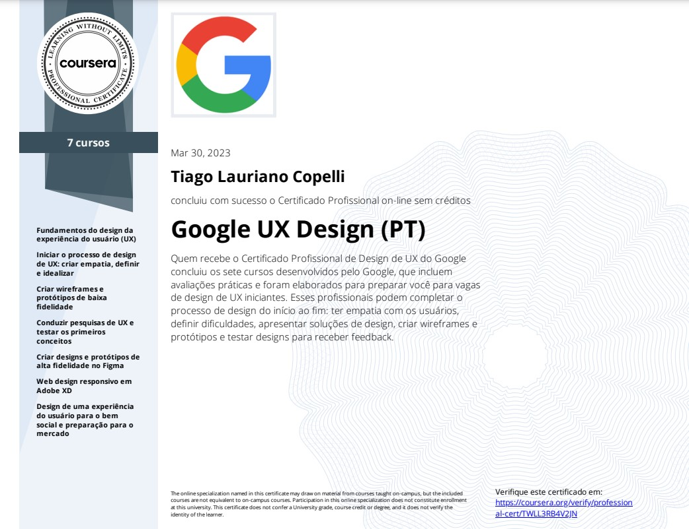

# Repositório criado para o Curso Coursera - Google de Design UX/UI

# Certificado Profissional de Design de UX do Google

<https://tiagocopelli.github.io/CursoGoogle-UX-UI/>

Neste curso foi criado 3 casos de estudos completo 
deste o Wireframe até o protótipo final.
Usando o Figma e o AdobeXD.

